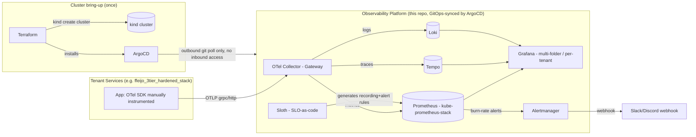

# Multi-Tenant Observability & Telemetry Platform (Home Lab)

A self-built, three-pillar observability platform (metrics, logs, traces) running on a
`kind` cluster on a single Debian homelab box, provisioned by Terraform and deployed
GitOps-style via ArgoCD, with SLO-as-code alerting and chaos-validated MTTD. Unlike the
platform's original design (built on top of a pre-existing k3s / Prometheus / Grafana
home lab), this repo now stands up its own cluster and its own metrics/dashboard stack
(`kube-prometheus-stack`) from nothing — `terraform apply` is the entire prerequisite.

This repo is deliberately scoped like a real platform-team project: it's not "I ran
Prometheus against my own app," it's "I designed an ingestion + storage + alerting layer
that other services/teams can onboard to self-service."

**Host constraint this repo is built around:** the Debian box has outbound internet
access (image pulls, Helm chart fetches, `apt` installs all work) but is not reachable
*by* any CI/CD tooling — no self-hosted GitHub Actions runner, no external system with
inbound access. ArgoCD fits this cleanly: it only ever polls the git remote over
outbound HTTPS from inside the cluster (default every 3m) — nothing external initiates
a connection into this host. There is deliberately no `.github/workflows/` in this repo;
CI-style validation (the k6 scripts in `ci/`) is run by hand, not by a pipeline.

## Why this exists

Built to close a specific, named gap: hands-on OpenTelemetry, multi-signal correlation,
and "observability as a platform" (vs. "observability as a personal dashboard"). See
`docs/architecture.md` for the full rationale and `docs/onboarding.md` for the artifact
that makes this a platform rather than a toy.

## Architecture



The tenant app's backend is instrumented by hand (`TracerProvider`/`MeterProvider`/
`LoggerProvider` wired directly in `app.py`), not via the `opentelemetry-instrument`
CLI — that approach doesn't work for this app at all (see `instrumentation/README.md`
and Week 2 of the training plan for why: a multi-stage Docker build that never
generates console-script wrappers, and no official OTel auto-instrumentor for Python's
stdlib `http.server` in the first place). `backend/` and `database/` in this repo are
corrected copies of the tenant app's source with the fixes that came out of that —
see "Repo layout" below.

## Components

| Layer | Tool | Role |
|---|---|---|
| Cluster | `kind` (Terraform-provisioned) | Disposable, single-host Kubernetes cluster — `terraform apply`/`destroy` is the entire lifecycle |
| GitOps | ArgoCD (installed by Terraform) | Pull-only (outbound git poll) sync of every component below from this repo |
| Ingestion | OpenTelemetry Collector (gateway) | Single entry point for all telemetry: OTLP receivers, tail-sampling, routing |
| Metrics | Prometheus (`kube-prometheus-stack`, this repo) | Metrics storage + PromQL |
| Traces | Tempo | Distributed trace storage, Grafana-native |
| Logs | Loki | Log aggregation, PromQL-shaped LogQL |
| Dashboards | Grafana (`kube-prometheus-stack`, this repo) | One pane of glass across all three signals, folder-per-tenant |
| SLOs | Sloth | SLO-as-code → generates Prometheus recording/alerting rules + burn-rate dashboards |
| Alerting | Alertmanager (`kube-prometheus-stack`, this repo) | Routes burn-rate alerts to a webhook |
| Validation | k6 + chaos scripts, run by hand | Load-generates signal, injects failure, measures MTTD — deliberately not CI-driven, see "Host constraint" above |

## Repo layout

```
.
├── ansible/                 # Debian host prep: docker, kind, kubectl, helm, terraform
├── terraform/               # Cluster lifecycle: kind create/destroy, ArgoCD install, app-of-apps bootstrap
├── k8s/                     # Platform namespace + the demo tenant app's manifests (corrected
│                            #   copies — see backend/ and database/ below; frontend's Service
│                            #   here is ClusterIP, not the source repo's NodePort, which
│                            #   collides with argocd-server-nodeport.yaml on this cluster)
├── backend/                 # Demo tenant app backend — corrected copy of
│                            #   ffeijo_3tier_hardened_stack/backend/ (manual OTel SDK
│                            #   instrumentation, fixed init-order/rollback bugs; see Week 2)
├── database/                # Demo tenant app database — corrected copy of
│                            #   ffeijo_3tier_hardened_stack/database/ (init.sql reordered so
│                            #   schema setup runs before privileges are stripped; see Week 2)
├── otel-collector/          # OTel Collector gateway: config, deployment, service
├── tempo/                   # Tempo Helm values (via ArgoCD Application)
├── loki/                    # Loki Helm values (via ArgoCD Application)
├── kube-prometheus-stack/   # Prometheus + Grafana + Alertmanager Helm values (via ArgoCD Application)
├── grafana/provisioning/    # Datasources + dashboards-as-code (sidecar-provisioned)
├── slo/                     # Sloth SLO specs (SLO-as-code)
├── argocd/                  # App-of-apps: every component deploys from this repo
├── instrumentation/         # How the demo tenant app gets OTel-instrumented
├── chaos/                   # Game-day runbook + injection scripts + results log
├── ci/                      # k6 scripts (Collector smoke test + demo-app load test) — run by
│                            #   hand, not by a pipeline (see "Host constraint" above)
└── docs/                    # Architecture, onboarding, SLO methodology, gameday template
```

## Quick start (Debian box, nothing pre-existing except Docker access)

```bash
ansible-playbook -i ansible/inventory.ini ansible/host-prep.yml
# log out/in once, so the docker group membership host-prep.yml granted takes effect

cd terraform
terraform init
terraform apply
```

`terraform apply` creates the `kind` cluster, installs ArgoCD into it, and applies
`argocd/app-of-apps.yaml` — from there ArgoCD's own automated sync (`prune` + `selfHeal`,
already set on every child Application) takes over and recursively syncs every component
(`kube-prometheus-stack`, `otel-collector`, `tempo`, `loki`, `slo-rules`) from this same
repo. Nothing after this point requires touching `kubectl apply` for the platform itself —
see `FernandoFeijo_Training_Plan_NVIDIA_Observability_1.md` Phase 0 for the full
verification sequence.

The demo tenant app (`k8s/00-namespace.yaml` through `05-frontend.yaml`, plus the
`backend/` and `database/` images) is not part of that GitOps sync — it's a separate,
by-hand deployment, since it's the thing being validated *against* the platform rather
than a platform component itself. See Week 2 of the training plan for the full apply +
build + load sequence.

## Development approach

This repo is built and committed **incrementally, phase by phase** (see `docs/BUILD_LOG.md`
for the running log), not delivered as a single dump — each phase below is its own set of
commits with a working, demoable state at the end of it.

| Phase | What ships | Status |
|---|---|---|
| 0 | `kind` cluster + ArgoCD + `kube-prometheus-stack` bootstrapped via Terraform | ✅ verified on real hardware (`basement-nas`) |
| 1 | OTel Collector gateway deployed via ArgoCD | ✅ verified end-to-end: trace ingest, tail-sampling, Prometheus scrape |
| 2 | Tempo + Loki added, wired into Grafana | ✅ verified: pods healthy, TraceQL/LogQL both return `"status": "success"` |
| 3 | Demo tenant app instrumented, k6 load validates traces end-to-end | 🟡 backend instrumented, load test passing at 100% — Tempo/Loki trace-log correlation not yet confirmed |
| 4 | Multi-tenant Grafana folder structure + onboarding doc | 🔲 |
| 5 | SLO-as-code (Sloth) + Alertmanager burn-rate routing | 🔲 |
| 6 | Chaos game-day: measured MTTD, documented in `chaos/results/` | 🔲 |
| 7 | k6 + chaos smoke-tested by hand (no CI — see "Host constraint" above) | 🔲 |

## What this is *not*

Honest scope statement, for interviews: this is a personal-scale lab (single Debian host,
`kind`'s nested-container topology instead of real bare-metal nodes, filesystem-backed
storage for Tempo/Loki, one demo tenant app, no CI/CD integration by design), not a
production multi-region deployment. What it *does* demonstrate faithfully: platform design
decisions (gateway vs. agent, tail-sampling, SLO-as-code, self-service onboarding pattern,
pull-only GitOps as the right shape for a host nothing external can reach) that transfer
directly to production scale.
